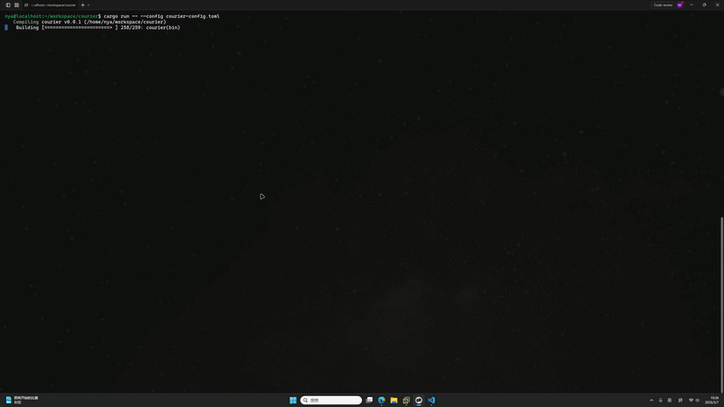

# Courier

Courier is a Rust TUI for Linux kernel patch mail workflows.

It is built for developers who work on mailing-list-driven review, especially in Linux kernel style flows, and want a terminal-first tool that keeps subscription, sync, review, patch application, and reply in one local workflow.



Chinese usage guide: [README-zh.md](README-zh.md)

## Status

Courier is under active development. The current `develop` branch already covers the core workflow:

- sync mail from `lore.kernel.org`
- sync a real IMAP `INBOX` through the built-in `My Inbox` subscription
- browse threads and detect patch series
- apply or export patches through `b4`
- compose and send replies from the TUI through `git send-email`

## Features

- Rust CLI with `courier tui`, `courier sync`, `courier doctor`, and `courier version`
- local SQLite storage with automatic runtime bootstrap
- incremental lore sync with checkpoint-based updates
- real IMAP `INBOX` sync with patch-oriented filtering
- background startup sync for enabled subscriptions
- periodic auto-sync for `My Inbox`
- patch series detection for subjects like `[PATCH vN M/N]`
- patch apply/export workflow powered by `b4`
- undo for the most recent successful apply in the current session
- kernel tree browser with source preview
- inline Vim-like editing and external Vim editing
- reply panel that fills `From`, `To`, `Cc`, `Subject`, `In-Reply-To`, and `References`
- real reply delivery through `git send-email`
- visual config editor, command palette completion, and structured operation logs

## Requirements

- Rust stable
- Git
- Python 3
  - needed when using the vendored `vendor/b4/b4.sh`
- `b4`
  - Courier resolves it in this order: `[b4].path` -> `COURIER_B4_PATH` -> `./vendor/b4/b4.sh` -> `b4` in `PATH`
- `git send-email`
  - only required if you want to send replies

`courier doctor` checks `b4`, `git send-email`, git mail identity, and IMAP connectivity.

## Installation

Source installation is the recommended path.

### Install from a clone

If you want to use the vendored `b4`, clone the repository with submodules:

```bash
git clone --recurse-submodules https://github.com/ChenMiaoi/courier.git
cd courier
cargo install --path . --locked
```

If you already cloned the repository without submodules:

```bash
git submodule update --init --recursive
```

### Install directly from GitHub

```bash
cargo install --git https://github.com/ChenMiaoi/courier.git --locked courier
```

In this mode, you should provide `b4` through `b4.path`, `COURIER_B4_PATH`, or your system `PATH`.

### Run from source

```bash
cargo run -- doctor
cargo run -- tui
```

## Quick Start

### 1. Check your environment

```bash
courier doctor
```

### 2. Prepare configuration

The default config file is `~/.courier/courier-config.toml`, and the default runtime directory is `~/.courier/`. Courier creates a minimal config file automatically on first run.

See [docs/config.example.toml](docs/config.example.toml) for a complete example.

Typical configuration:

```toml
[source]
mailbox = "io-uring"

[imap]
email = "you@example.com"
user = "you@example.com"
pass = "app-password"
server = "imap.example.com"
serverport = 993
encryption = "ssl"

[kernel]
tree = "/path/to/linux"
```

Notes:

- relative paths are resolved from the config file directory
- `[imap]` is optional if you only use lore sync
- when IMAP config is complete, `My Inbox` is enabled by default on first use
- `imap.proxy` supports `http://`, `socks5://`, and `socks5h://`
- reply identity prefers `git config sendemail.from`, then falls back to `git config user.name` and `git config user.email`
- `ui.startup_sync` defaults to `true`
- `ui.inbox_auto_sync_interval_secs` defaults to `30`

### 3. Sync mail

Sync a lore mailbox:

```bash
courier sync --mailbox io-uring
```

Sync a real IMAP inbox:

```bash
courier sync --mailbox INBOX
```

Use local `.eml` fixtures for debugging:

```bash
courier sync --mailbox test --fixture-dir ./fixtures
```

### 4. Start the TUI

```bash
courier tui
```

Inside the TUI:

- `:` opens the command palette
- `y` / `n` enable or disable the selected subscription
- `Enter` opens the selected mailbox or thread
- `a` applies the current patch series
- `d` exports the current patch series
- `u` undoes the most recent successful apply from the current session
- `r` or `e` opens the reply panel
- `Tab` switches between the mail page and the code browser

When IMAP is configured, `My Inbox` joins startup sync and continues periodic background sync while the TUI remains open.
Enabled mailing-list subscriptions also keep doing periodic background sync while the TUI remains open so Linux lore and QEMU archive mailboxes keep pulling new mail.

## Documentation

- [README-zh.md](README-zh.md): Chinese usage guide
- [docs/config.example.toml](docs/config.example.toml): configuration example
- [docs/design.md](docs/design.md): design notes
- [docs/reply-format-spec.md](docs/reply-format-spec.md): reply panel and sending format
- [docs/mvp-milestones.md](docs/mvp-milestones.md): historical milestone record
- [docs/reply-mvp-milestones.md](docs/reply-mvp-milestones.md): reply workflow evolution

## Development

Common development commands:

```bash
cargo fmt --all -- --check
cargo clippy --all-targets --all-features -- -D warnings
cargo test --all-targets --all-features
```

The repository includes GitHub Actions CI for `push` and `pull_request` with the same formatting, lint, and test checks.

## Contributing

Issues and pull requests are welcome.

Before sending changes, run:

```bash
cargo fmt --all -- --check
cargo clippy --all-targets --all-features -- -D warnings
cargo test --all-targets --all-features
```

If you change user-visible behavior, commands, config keys, or workflows, update the relevant documentation in the same change.

## License

Courier is licensed under [LGPL-2.1](LICENSE). Vendored third-party components keep their upstream licenses.
